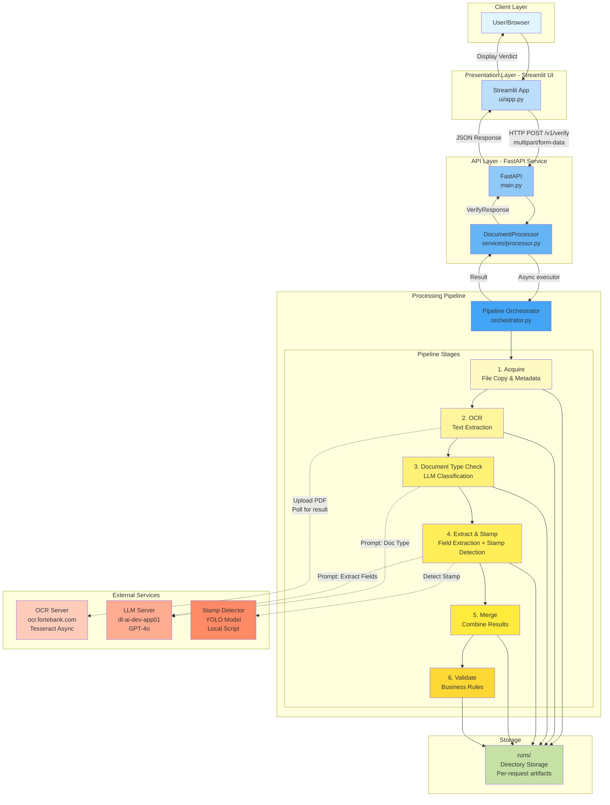
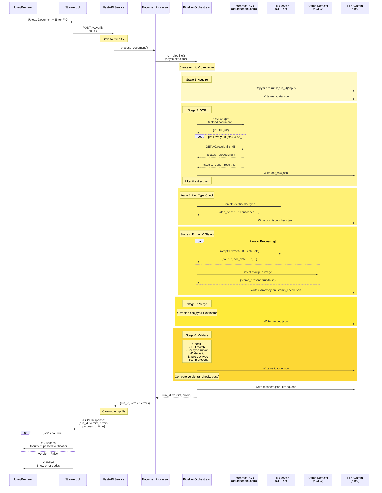

# RB-OCR System Architecture

High-level system architecture and request flow for the RB Loan Deferment Document Verification System.

## System Components



## Request Flow Sequence



## Data Flow & Processing Stages

```mermaid
flowchart TD
    Start([User uploads document + FIO]) --> Acquire
    
    Acquire[Stage 1: Acquire<br/>━━━━━━━━━━<br/>Copy file to runs dir<br/>Create metadata.json]
    
    Acquire --> OCRStage[Stage 2: OCR<br/>━━━━━━━━━━<br/>Upload to Tesseract OCR<br/>Poll for results<br/>Filter raw OCR output]
    
    OCRStage --> DocType[Stage 3: Doc Type Check<br/>━━━━━━━━━━<br/>LLM identifies document type<br/>справка о болезни / ,.../ etc]
    
    DocType --> ExtractStamp
    
    subgraph ExtractStamp[Stage 4: Extract & Stamp - Parallel]
        Extract[LLM Extraction<br/>━━━━━━━━━━<br/>Extract: FIO, doc_date,<br/>organization, etc]
        StampDet[Stamp Detection<br/>━━━━━━━━━━<br/>YOLO model detects<br/>presence of official stamp]
    end
    
    ExtractStamp --> Merge[Stage 5: Merge<br/>━━━━━━━━━━<br/>Combine doc_type + extraction<br/>Add stamp_present flag]
    
    Merge --> Validate[Stage 6: Validate<br/>━━━━━━━━━━<br/>Business Rules Validation]
    
    subgraph Validate
        direction TB
        Check1[✓ FIO Match<br/>meta FIO == extracted FIO]
        Check2[✓ Doc Type Known<br/>LLM identified type]
        Check3[✓ Date Valid<br/>Within validity window]
        Check4[✓ Single Doc Type<br/>Not multiple types]
        Check5[✓ Stamp Present<br/>If enabled]
        
        Check1 --> Check2 --> Check3 --> Check4 --> Check5
    end
    
    Validate --> Verdict{All checks<br/>passed?}
    
    Verdict -->|Yes| Success([Verdict: TRUE<br/>Errors: empty])
    Verdict -->|No| Failure([Verdict: FALSE<br/>Errors: list of failures])
    
    Success --> Response
    Failure --> Response
    
    Response([Return Response<br/>━━━━━━━━━━<br/>run_id, verdict, errors,<br/>processing_time])
    
    style Acquire fill:#fff9c4
    style OCRStage fill:#fff59d
    style DocType fill:#fff176
    style Extract fill:#ffee58
    style StampDet fill:#ffee58
    style Merge fill:#ffeb3b
    style Validate fill:#fdd835
    style Success fill:#c8e6c9
    style Failure fill:#ffcdd2
    style Response fill:#bbdefb
```



## Key Components Details

### 1. **Streamlit UI** (`ui/app.py`)
- **Purpose**: User-facing web interface
- **Functionality**:
  - File upload (PDF, JPEG, PNG)
  - FIO input field
  - Calls FastAPI `/v1/verify` endpoint
  - Displays verdict and error messages
- **Configuration**: 
  - API URL: `http://rb-ocr-dev-app-uv01.fortebank.com/rb-ocr/api`
  - Timeout: 120 seconds

### 2. **FastAPI Service** (`fastapi-service/main.py`)
- **Endpoints**:
  - `POST /v1/verify`: Main verification endpoint
  - `GET /health`: Health check
  - `GET /`: API info
- **Response Model**: `VerifyResponse`
  ```json
  {
    "run_id": "string",
    "verdict": boolean,
    "errors": ["error_code1", "error_code2"],
    "processing_time_seconds": number
  }
  ```

### 3. **Pipeline Orchestrator** (`pipeline/orchestrator.py`)
- **Core orchestration logic**
- **Creates per-request directory structure**:
  ```
  runs/{run_id}/
  ├── input/          # Original uploaded file
  ├── ocr/            # OCR results
  ├── llm/            # LLM responses (doc type, extraction)
  ├── meta/           # Merged results
  └── validation/     # Stamp detection & validation
  ```
- **Stages**: Sequential processing pipeline
- **Error Handling**: Standardized error codes

### 4. **External Clients**

#### **Tesseract OCR Client** (`pipeline/clients/tesseract_async_client.py`)
- Async HTTP client for OCR server
- Upload → Poll → Result pattern
- Polls every 2 seconds, max 300 seconds timeout
- Handles image-to-PDF conversion if needed

#### **LLM Client** (`pipeline/clients/llm_client.py`)
- Calls ForteBank internal LLM endpoint
- Model: GPT-4o
- Two use cases:
  1. Document type classification
  2. Field extraction (FIO, dates, organization)
- SSL verification disabled (dev environment)

#### **Stamp Detector** (`pipeline/processors/stamp_check.py`)
- Subprocess call to YOLO-based detector
- Path: `/home/rb_admin2/apps/main-dev/stamp-processing/`
- For PDFs: renders to JPEG first (PyMuPDF)
- Returns: `{stamp_present: boolean}`

### 5. **Validation Logic** (`pipeline/processors/validator.py`)

**Checks performed**:

| Check | Description | Error Code |
|-------|-------------|------------|
| `fio_match` | Extracted FIO matches provided FIO (fuzzy matching with KZ/RU/Latin normalization) | `FIO_MISMATCH` |
| `doc_type_known` | LLM successfully identified document type | `DOC_TYPE_UNKNOWN` |
| `doc_date_valid` | Document date within validity window | `DOC_DATE_TOO_OLD` |
| `single_doc_type_valid` | File contains only one document type | `MULTIPLE_DOC_TYPES` |
| `stamp_present` | Official stamp detected (if enabled) | `STAMP_NOT_FOUND` |

**Verdict Calculation**:
```
verdict = fio_match AND doc_type_known AND doc_date_valid 
          AND single_doc_type_valid AND (stamp_present IF enabled)
```

## Error Codes

| Code | Meaning |
|------|---------|
| `DOC_DATE_TOO_OLD` | Document is expired |
| `DOC_TYPE_UNKNOWN` | Cannot identify document type |
| `MULTIPLE_DOC_TYPES` | Multiple document types detected |
| `FIO_MISMATCH` | Name mismatch between form and document |
| `STAMP_NOT_FOUND` | Official stamp not detected |
| `OCR_FAILED` | Text recognition error |
| `LLM_FAILED` | LLM processing error |

## Technology Stack

- **UI**: Streamlit
- **API**: FastAPI (Uvicorn)
- **OCR**: Tesseract (async via external server)
- **LLM**: GPT-4o (ForteBank internal endpoint)
- **Stamp Detection**: YOLO v8+ (PyTorch)
- **Image Processing**: PyMuPDF (fitz), PIL
- **Text Matching**: RapidFuzz
- **Deployment**: Docker containers (linux/amd64)

## Deployment Architecture

```mermaid
graph LR
    subgraph "Docker Host"
        subgraph "Container: UI"
            UIApp[Streamlit<br/>Port 8501]
        end
        
        subgraph "Container: API"
            APIApp[FastAPI<br/>Port 8000]
            RunsVol[/runs volume]
        end
    end
    
    subgraph "External Services"
        OCRSvc[OCR Server<br/>ocr.fortebank.com]
        LLMSvc[LLM Server<br/>dl-ai-dev-app01]
    end
    
    Nginx[Nginx Reverse Proxy<br/>rb-ocr-dev-app-uv01<br/>.fortebank.com]
    
    Users[Users] --> Nginx
    Nginx -->|/rb-ocr/ui| UIApp
    Nginx -->|/rb-ocr/api| APIApp
    
    UIApp -.->|API calls| APIApp
    APIApp -.-> OCRSvc
    APIApp -.-> LLMSvc
    
    APIApp --- RunsVol
    
    style UIApp fill:#90caf9
    style APIApp fill:#66bb6a
    style RunsVol fill:#fff59d
    style OCRSvc fill:#ffab91
    style LLMSvc fill:#ffab91
    style Nginx fill:#ce93d8
```

## Performance Characteristics

- **Average Processing Time**: ~10-30 seconds per document
  - OCR: 5-15 seconds (depends on server load)
  - LLM calls: 2-5 seconds each (doc type + extraction)
  - Stamp detection: 1-3 seconds
  - Validation: <1 second
- **Timeout Configuration**: 
  - OCR poll: 300 seconds max
  - API request: 120 seconds
  - HTTP client: 60 seconds
- **Concurrency**: Async processing via FastAPI
- **Storage**: Per-request artifacts in `runs/` directory

## Future Enhancements (Noted in Conversation History)

1. **Database Integration**: Replace file-based storage with PostgreSQL
2. **Monitoring**: Add metrics and observability
3. **Caching**: Cache LLM responses for common document types
4. **Batch Processing**: Support multiple documents in single request
5. **API Versioning**: Formal versioning strategy
