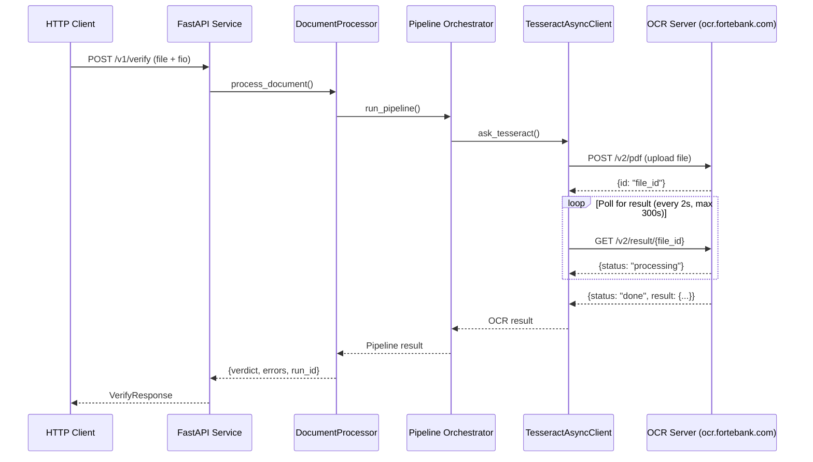

# OCR Client Configuration Analysis

## Overview

This document analyzes how the FastAPI service calls the OCR client (`https://ocr.fortebank.com/v2`), including all configurations for retries, polling, and timeouts to assess potential overload risks.

---

## Request Flow



---

## OCR Client Configuration

### File Location
[tesseract_async_client.py](file:///Users/aktilekishanov/Documents/career/forte/ds/rb_ocr/2025-11-14-apps-from-server-RBOCR/apps/fastapi-service/pipeline/clients/tesseract_async_client.py)

### Key Configuration Parameters

| Parameter | Default Value | Description | Location |
|-----------|---------------|-------------|----------|
| **base_url** | `https://ocr.fortebank.com/v2` | OCR service endpoint | Line 18, 84, 126 |
| **client_timeout** | `60.0` seconds | HTTP request timeout (upload/download) | Line 19, 88, 130 |
| **poll_interval** | `2.0` seconds | Time between status checks | Line 58, 86, 128 |
| **timeout** | `300.0` seconds | Maximum wait time for OCR completion | Line 59, 87, 129 |
| **verify** | `True` | SSL certificate verification | Line 20, 89, 127 |

### Configuration Details

#### 1. **HTTP Client Timeout** (`client_timeout = 60.0s`)
```python
# Line 28 in tesseract_async_client.py
self._client = httpx.AsyncClient(timeout=self._timeout, verify=self._verify)
```
- **Purpose**: Timeout for individual HTTP requests (upload and status checks)
- **Impact**: Each HTTP call (upload or GET result) will fail if it takes longer than 60 seconds
- **Risk**: If OCR server is slow to respond to individual requests, this could cause failures

#### 2. **Polling Interval** (`poll_interval = 2.0s`)
```python
# Lines 55-78 in tesseract_async_client.py
async def wait_for_result(
    self,
    file_id: str,
    poll_interval: float = 2.0,
    timeout: float = 300.0,
) -> dict[str, Any]:
    # ...
    while True:
        last = await self.get_result(file_id)
        # Check status...
        await asyncio.sleep(poll_interval)  # Line 78
```
- **Purpose**: How often to check if OCR processing is complete
- **Impact**: The service polls the OCR server **every 2 seconds**
- **Risk**: **HIGH OVERLOAD RISK** - Frequent polling can overwhelm the OCR server

#### 3. **Overall Timeout** (`timeout = 300.0s`)
```python
# Line 64 in tesseract_async_client.py
deadline = loop.time() + timeout
```
- **Purpose**: Maximum time to wait for OCR processing to complete
- **Impact**: After 5 minutes, the client stops polling and returns the last status
- **Calculation**: Maximum polls = 300s / 2s = **150 polling requests per document**

---

## Retry Configuration

### ❌ **NO RETRY MECHANISM**

**Critical Finding**: The code has **NO automatic retry logic** for failed requests.

```python
# Lines 94-102 in tesseract_async_client.py
upload_resp = await client.upload(file_path)
file_id = upload_resp.get("id")
# ...
if wait and file_id:
    result_obj = await client.wait_for_result(
        file_id, poll_interval=poll_interval, timeout=timeout
    )
```

**Implications**:
- If the upload fails → immediate failure, no retry
- If a status check fails → immediate failure, no retry
- If the OCR server returns an error → immediate failure, no retry

---

## Overload Risk Assessment

### 🔴 **HIGH RISK: Aggressive Polling**

#### Problem 1: Frequent Polling
- **Polling frequency**: Every 2 seconds
- **Maximum polls per document**: 150 requests (300s / 2s)
- **Load multiplier**: If 10 concurrent requests → **75 requests/second** to OCR server

#### Problem 2: No Request Throttling
```python
# Line 257 in orchestrator.py
ocr_result = ask_tesseract(str(ctx.saved_path), output_dir=str(ctx.ocr_dir), save_json=True)
```
- Each FastAPI request immediately triggers an OCR request
- No queuing or rate limiting
- No connection pooling limits

#### Problem 3: No Backoff Strategy
- Polling interval is **constant** at 2 seconds
- No exponential backoff
- No adaptive polling based on server load

### Load Calculation Example

**Scenario**: 20 concurrent document verifications

| Metric | Value |
|--------|-------|
| Upload requests | 20 (one-time) |
| Polling requests per doc | ~150 (max) |
| Total polling requests | 3,000 |
| Duration | 300 seconds (5 min) |
| **Average polling rate** | **10 requests/second** |
| **Peak polling rate** | **10 requests/second** (if all start together) |

---

## Code References

### Main Entry Point
[orchestrator.py:257](file:///Users/aktilekishanov/Documents/career/forte/ds/rb_ocr/2025-11-14-apps-from-server-RBOCR/apps/fastapi-service/pipeline/orchestrator.py#L257)
```python
def stage_ocr(ctx: PipelineContext) -> dict[str, Any] | None:
    with stage_timer(ctx, "ocr"):
        ocr_result = ask_tesseract(str(ctx.saved_path), output_dir=str(ctx.ocr_dir), save_json=True)
```

### OCR Client Implementation
[tesseract_async_client.py:121-174](file:///Users/aktilekishanov/Documents/career/forte/ds/rb_ocr/2025-11-14-apps-from-server-RBOCR/apps/fastapi-service/pipeline/clients/tesseract_async_client.py#L121-L174)
```python
def ask_tesseract(
    pdf_path: str,
    output_dir: str = "output",
    save_json: bool = True,
    *,
    base_url: str = "https://ocr.fortebank.com/v2",
    verify: bool = True,
    poll_interval: float = 2.0,
    timeout: float = 300.0,
    client_timeout: float = 60.0,
) -> dict[str, Any]:
```

### Polling Logic
[tesseract_async_client.py:55-78](file:///Users/aktilekishanov/Documents/career/forte/ds/rb_ocr/2025-11-14-apps-from-server-RBOCR/apps/fastapi-service/pipeline/clients/tesseract_async_client.py#L55-L78)
```python
async def wait_for_result(
    self,
    file_id: str,
    poll_interval: float = 2.0,
    timeout: float = 300.0,
) -> dict[str, Any]:
    loop = asyncio.get_event_loop()
    deadline = loop.time() + timeout
    last: dict[str, Any] = {}
    while True:
        last = await self.get_result(file_id)
        status = str(last.get("status", "")).lower()
        if (
            status in {"done", "completed", "success", "finished", "ready"}
            or last.get("result") is not None
        ):
            return last
        if status in {"failed", "error"}:
            return last
        if loop.time() >= deadline:
            return last
        await asyncio.sleep(poll_interval)
```

---

## Recommendations to Reduce Overload

### 1. **Increase Polling Interval**
```python
# Change from 2.0s to 5.0s or 10.0s
poll_interval: float = 5.0  # or 10.0
```
**Impact**: Reduces polling requests by 60-80%

### 2. **Implement Exponential Backoff**
```python
async def wait_for_result_with_backoff(
    self,
    file_id: str,
    initial_interval: float = 2.0,
    max_interval: float = 30.0,
    timeout: float = 300.0,
) -> dict[str, Any]:
    interval = initial_interval
    deadline = loop.time() + timeout
    while True:
        last = await self.get_result(file_id)
        # ... check status ...
        await asyncio.sleep(interval)
        interval = min(interval * 1.5, max_interval)  # Exponential backoff
```

### 3. **Add Retry Logic with Backoff**
```python
from tenacity import retry, stop_after_attempt, wait_exponential

@retry(
    stop=stop_after_attempt(3),
    wait=wait_exponential(multiplier=1, min=2, max=10)
)
async def upload_with_retry(self, file_path: str):
    return await self.upload(file_path)
```

### 4. **Implement Connection Pooling Limits**
```python
# Limit concurrent connections to OCR server
limits = httpx.Limits(max_keepalive_connections=5, max_connections=10)
self._client = httpx.AsyncClient(timeout=self._timeout, limits=limits)
```

### 5. **Add Request Queue/Semaphore**
```python
# In DocumentProcessor or main.py
ocr_semaphore = asyncio.Semaphore(5)  # Max 5 concurrent OCR requests

async def process_with_limit(self, ...):
    async with ocr_semaphore:
        return await self.process_document(...)
```

---

## Environment Variables

**Note**: Currently, there are **NO environment variables** to configure OCR client behavior.

All values are hardcoded defaults. Consider adding:
```python
# In config.py
OCR_BASE_URL = os.getenv("OCR_BASE_URL", "https://ocr.fortebank.com/v2")
OCR_POLL_INTERVAL = float(os.getenv("OCR_POLL_INTERVAL", "2.0"))
OCR_TIMEOUT = float(os.getenv("OCR_TIMEOUT", "300.0"))
OCR_CLIENT_TIMEOUT = float(os.getenv("OCR_CLIENT_TIMEOUT", "60.0"))
OCR_MAX_CONCURRENT = int(os.getenv("OCR_MAX_CONCURRENT", "5"))
```

---

## Summary

| Aspect | Current State | Risk Level |
|--------|---------------|------------|
| **Polling Interval** | 2 seconds (aggressive) | 🔴 HIGH |
| **Retry Logic** | None | 🟡 MEDIUM |
| **Connection Limits** | None | 🟡 MEDIUM |
| **Backoff Strategy** | None | 🔴 HIGH |
| **Concurrent Request Limits** | None | 🔴 HIGH |
| **Configurable via Env** | No | 🟡 MEDIUM |

**Overall Assessment**: The current implementation has a **HIGH risk of overloading the OCR service** due to aggressive polling (every 2 seconds) and lack of request throttling or backoff strategies.
