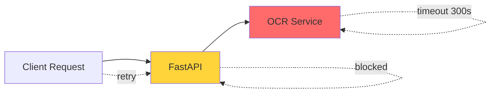

# Evaluation of AS-IS Error Handling

## Executive Summary

The current error handling implementation shows **good separation of concerns at the pipeline level** but **fails to follow REST API best practices** and lacks resilience patterns needed for production systems. This evaluation assesses the AS-IS state against industry standards.

---

## 1. Compliance with Best Practices

### ✅ Strengths

#### 1.1 Clear Error Code Taxonomy
**Rating: ⭐⭐⭐⭐⭐ (Excellent)**

```python
ERROR_MESSAGES_RU: dict[str, str] = {
    "FIO_MISMATCH": "ФИО не совпадает",
    "DOC_TYPE_UNKNOWN": "Не удалось определить тип документа",
    # ...
}
```

**Why it's good**:
- Centralized error code definitions
- Consistent naming convention
- Localized messages for end-users
- Easy to extend

**Best Practice Alignment**: ✅ Follows RFC 7807 Problem Details principles

#### 1.2 Graceful Degradation Pattern
**Rating: ⭐⭐⭐⭐☆ (Very Good)**

The pipeline completes execution even when errors occur, providing maximum diagnostic information:

```python
for stage in (stage_acquire, stage_ocr, stage_doc_type_check, ...):
    res = stage(ctx)
    if res is not None:  # Error occurred
        return res  # Return structured error response
```

**Why it's good**:
- Always returns valid JSON response
- Collects all artifact information
- Provides `run_id` for debugging
- Writes complete audit trail

**Best Practice Alignment**: ✅ Follows fail-safe design patterns

#### 1.3 Logging with Context
**Rating: ⭐⭐⭐⭐☆ (Very Good)**

```python
logger.info(f"[NEW REQUEST] FIO={fio}, file={file.filename}")
logger.error(f"[ERROR] {e}", exc_info=True)
```

**Why it's good**:
- Structured prefixes for filtering
- Full stack traces on errors
- Request correlation via `run_id`

---

### ❌ Critical Issues

#### 2.1 HTTP Status Code Misuse
**Rating: ⭐☆☆☆☆ (Critical Failure)**

**Issue**: All errors return **HTTP 500**, violating REST principles.

| Scenario | Current | Should Be | Impact |
|----------|---------|-----------|--------|
| Invalid file type | 500 | 400 Bad Request | Client can't distinguish retryable errors |
| Missing parameter | 500 | 400 Bad Request | Same |
| S3 file not found | 500 | 404 Not Found | Misleading - implies server fault |
| OCR timeout | 500 | 504 Gateway Timeout | No retry guidance |
| LLM rate limit | 500 | 429 Too Many Requests | Should include Retry-After header |
| Valid rejection | 200 | 200 OK | Actually correct! |

**Best Practice Violation**: ❌ Violates RFC 7231 (HTTP Semantics)

**Consequences**:
1. **Monitoring Issues**: Can't distinguish real server errors from client mistakes
2. **Client Confusion**: No guidance on whether to retry
3. **SLA Impact**: Client errors inflate error rate metrics
4. **Cache Behavior**: CDNs/proxies won't cache responses appropriately

#### 2.2 No Input Validation
**Rating: ⭐☆☆☆☆ (Critical Failure)**

```python
@app.post("/v1/verify")
async def verify_document(
    file: UploadFile = File(...),
    fio: str = Form(...),  # ❌ No validation!
):
```

**Missing Validations**:
- File size limits (could upload 10GB file)
- File type validation (could upload .exe file)
- FIO format validation (empty string accepted)
- IIN format validation (Kafka endpoint)
- S3 path validation (could contain directory traversal)

**Best Practice Violation**: ❌ OWASP Top 10 - Injection/Input Validation

**Security Risks**:
- DoS via large file uploads
- File system attacks
- Injection attacks in logs

#### 2.3 Error Message Leakage
**Rating: ⭐⭐☆☆☆ (Poor)**

```python
raise HTTPException(
    status_code=500,
    detail=f"Internal processing error: {str(e)}"  # ❌ Exposes internals
)
```

**Leaked Information**:
- Stack traces (file paths, line numbers)
- Internal service URLs
- Database connection strings (if in exception)
- Library versions

**Example Leak**:
```json
{
  "detail": "Internal processing error: FileNotFoundError: [Errno 2] No such file or directory: '/Users/aktilekishanov/Documents/career/forte/ds/rb_ocr/2025-11-14-apps-from-server-RBOCR/apps/fastapi-service/runs/2025-12-05/550e8400-e29b-41d4-a716-446655440000/input/original/document.pdf'"
}
```

**Best Practice Violation**: ❌ OWASP A01:2021 - Broken Access Control

#### 2.4 Custom Exceptions Not Utilized
**Rating: ⭐⭐☆☆☆ (Poor)**

The LLM client defines excellent exception hierarchy:

```python
class LLMNetworkError(LLMClientError): ...
class LLMHTTPError(LLMClientError): ...
class LLMResponseError(LLMClientError): ...
```

But orchestrator catches them all as generic `Exception`:

```python
def stage_doc_type_check(ctx: PipelineContext) -> dict[str, Any] | None:
    try:
        dtc_raw_str = check_single_doc_type(ctx.pages_obj)
        # ...
    except Exception as e:  # ❌ Loses specific error type!
        return fail_and_finalize("DTC_FAILED", str(e), ctx)
```

**Lost Information**:
- Network errors (should retry)
- HTTP 429 (rate limit, should backoff)
- Parsing errors (permanent failure)

**Best Practice Violation**: ❌ Violates Single Responsibility Principle

#### 2.5 No Timeout Strategy
**Rating: ⭐☆☆☆☆ (Critical Failure)**

**LLM Client**:
```python
with urllib.request.urlopen(req, context=context, timeout=30) as response:
    # What if it takes 29.9 seconds every time?
```

**OCR Client**:
```python
timeout: float = 300.0  # 5 minutes!
```

**Issues**:
- No exponential backoff
- No circuit breaker pattern
- Long timeouts can exhaust thread pool
- Cascading failures not prevented

**Best Practice Violation**: ❌ Violates Microservices Resilience Patterns

#### 2.6 No Retry Logic
**Rating: ⭐⭐☆☆☆ (Poor)**

All external service calls fail immediately on first error:

```python
ocr_result = ask_tesseract(...)  # Single attempt
if not ocr_result.get("success"):
    return fail_and_finalize("OCR_FAILED", ...)  # Give up
```

**Should Implement**:
- Retry with exponential backoff for transient failures
- Different retry strategies for different error types
- Maximum retry limits
- Jitter to prevent thundering herd

**Best Practice Violation**: ❌ Violates Cloud Design Patterns (Retry Pattern)

#### 2.7 No Structured Logging
**Rating: ⭐⭐⭐☆☆ (Acceptable)**

Current logging is string-based:
```python
logger.info(f"[NEW REQUEST] FIO={fio}, file={file.filename}")
```

**Issues**:
- Hard to parse for log aggregation (Elasticsearch, Splunk)
- No structured fields for filtering
- No distributed tracing correlation
- No log levels for different error severities

**Should Use**:
```python
logger.info("new_request", extra={
    "event_type": "request.received",
    "fio": fio,
    "filename": file.filename,
    "trace_id": trace_id,
})
```

**Best Practice Violation**: ⚠️ Violates Observability Best Practices

---

## 2. Security Assessment

### 2.1 Information Disclosure
**Severity: HIGH**

- ❌ Stack traces exposed in HTTP responses
- ❌ File system paths revealed
- ❌ Internal service URLs visible
- ❌ No rate limiting (DoS vulnerability)

### 2.2 Input Validation
**Severity: CRITICAL**

- ❌ No file size limits
- ❌ No file type validation
- ❌ No parameter sanitization
- ❌ No path traversal protection

### 2.3 Error Handling
**Severity: MEDIUM**

- ✅ Errors don't crash the service
- ✅ Errors are logged
- ❌ But error details leak to clients

---

## 3. Operational Impact

### 3.1 Monitoring & Alerting
**Rating: ⭐⭐☆☆☆ (Poor)**

**Problems**:
- Can't distinguish client errors from server errors in metrics
- Can't set meaningful SLOs (all errors are 500s)
- False alerts on client mistakes
- Hard to identify systemic issues

**Example**:
```
Total requests: 1000
5xx errors: 200 (20% error rate)

Breakdown (if we had proper status codes):
- 400 Bad Request: 150 (15%) - Client errors, not our fault
- 500 Internal Server Error: 30 (3%) - Actual server issues
- 504 Gateway Timeout: 20 (2%) - External service issues
```

### 3.2 Debugging & Troubleshooting
**Rating: ⭐⭐⭐☆☆ (Acceptable)**

**Strengths**:
- Run ID for correlation
- Full stack traces in logs
- Artifacts saved to disk

**Weaknesses**:
- No distributed tracing
- No correlation across services
- No structured logs for querying

### 3.3 Client Integration
**Rating: ⭐⭐☆☆☆ (Poor)**

**Client Perspective**:
```javascript
// Client code
try {
  const response = await fetch('/v1/verify', {...});
  
  if (response.status === 500) {
    // Is this:
    // 1. Network error? (should retry)
    // 2. Invalid input? (should fix request)
    // 3. Service down? (should circuit break)
    // 4. Rate limited? (should backoff)
    // ❌ No way to know!
  }
} catch (error) {
  // What should I do?
}
```

---

## 4. Scalability & Resilience

### 4.1 Cascading Failure Risk
**Severity: HIGH**



**Scenario**:
1. OCR service slows down
2. Requests wait up to 300s
3. Thread pool exhausts
4. New requests queue up
5. Entire service becomes unresponsive

**Missing Patterns**:
- Circuit breaker
- Bulkhead isolation
- Request timeout
- Graceful degradation

### 4.2 Resource Exhaustion
**Severity: MEDIUM**

**Potential Issues**:
- Unlimited file uploads → disk full
- No connection pooling → socket exhaustion
- No request queue limits → memory exhaustion
- Synchronous processing → thread starvation

---

## 5. Maintainability

### 5.1 Code Organization
**Rating: ⭐⭐⭐⭐☆ (Very Good)**

**Strengths**:
- Clear separation: API layer, service layer, pipeline layer
- Centralized error codes
- Modular stage-based processing

**Weaknesses**:
- Error handling logic scattered across files
- No centralized exception handling middleware

### 5.2 Extensibility
**Rating: ⭐⭐⭐☆☆ (Acceptable)**

**Adding New Error Code**:
✅ Easy - just add to `ERROR_MESSAGES_RU`

**Adding New HTTP Status Code**:
❌ Hard - requires changes in multiple places

**Adding New Validation**:
❌ No framework - need to write custom logic

---

## 6. Comparison with Industry Standards

### 6.1 RFC 7807 (Problem Details for HTTP APIs)

**Standard Requirements**:
```json
{
  "type": "https://example.com/probs/out-of-stock",
  "title": "Out of Stock",
  "status": 400,
  "detail": "Item B00027Y5QG is no longer available",
  "instance": "/orders/1234"
}
```

**Current Implementation**:
```json
{
  "run_id": "550e8400-...",
  "verdict": false,
  "errors": [
    {
      "code": "FIO_MISMATCH",
      "message": "ФИО не совпадает"
    }
  ]
}
```

**Gaps**:
- ❌ No `type` URI for error documentation
- ❌ No `status` field
- ❌ No `title` field
- ⚠️ `detail` field is in `message` (acceptable)
- ✅ `instance` is `run_id` (good!)

### 6.2 Google API Design Guide

**Recommendations**:
1. Use standard HTTP status codes ❌
2. Provide detailed error messages ✅
3. Support partial success ✅ (via `verdict=false` + structured errors)
4. Include retry information ❌
5. Localize error messages ✅

**Score**: 3/5

### 6.3 Microsoft REST API Guidelines

**Recommendations**:
1. Use problem detail format ❌
2. Include error codes ✅
3. Include correlation IDs ✅ (`run_id`)
4. Don't leak implementation details ❌
5. Support debugging ✅ (artifacts)

**Score**: 3/5

---

## 7. Risk Assessment

| Risk | Severity | Likelihood | Priority |
|------|----------|------------|----------|
| Security - Information Disclosure | HIGH | HIGH | **P0** |
| Security - DoS via large files | HIGH | MEDIUM | **P0** |
| Ops - False monitoring alerts | MEDIUM | HIGH | **P1** |
| Ops - Cascading failures | HIGH | MEDIUM | **P1** |
| UX - Poor client error handling | MEDIUM | HIGH | **P1** |
| Compliance - Non-standard HTTP | LOW | HIGH | **P2** |

---

## 8. Overall Assessment

### Final Score: 4.5/10

**Category Scores**:
| Category | Score | Weight | Weighted |
|----------|-------|--------|----------|
| Functionality | 8/10 | 20% | 1.6 |
| Security | 3/10 | 25% | 0.75 |
| Reliability | 4/10 | 20% | 0.8 |
| Best Practices | 4/10 | 15% | 0.6 |
| Maintainability | 7/10 | 10% | 0.7 |
| Observability | 5/10 | 10% | 0.5 |

**Total**: 4.5/10

---

## 9. Recommendation

**Status**: 🔴 **NOT PRODUCTION-READY**

**Critical Blockers**:
1. Fix HTTP status code usage
2. Implement input validation
3. Stop leaking error details
4. Add retry logic and circuit breakers

**Timeline**: Estimated 2-3 weeks for remediation

**Next Steps**: Review TO-BE architecture proposal
