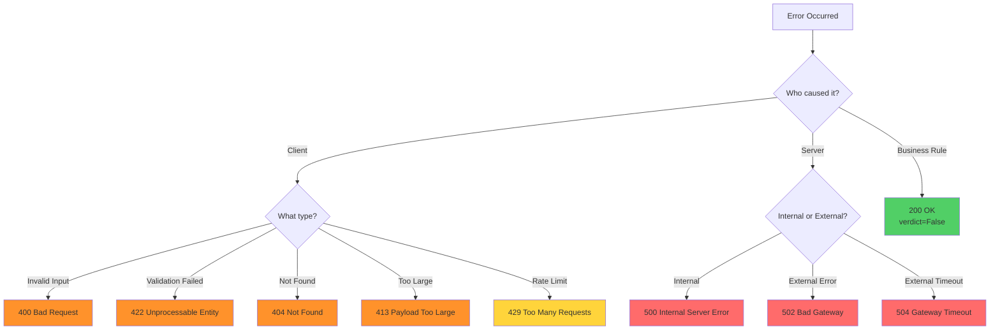
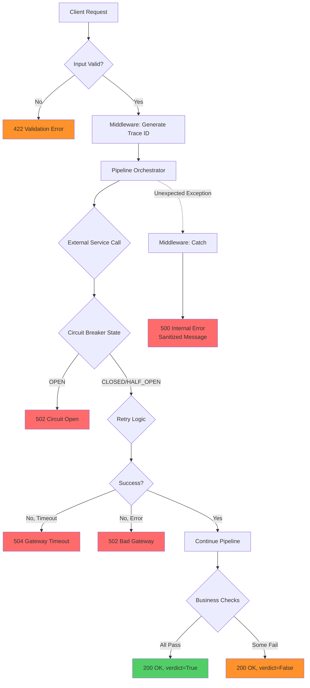

# TO-BE: Proposed Error Handling Architecture

## Executive Summary

This document proposes a **comprehensive, production-grade error handling architecture** that:
- ✅ Follows REST API best practices (RFC 7231, RFC 7807)
- ✅ Implements proper HTTP status code semantics
- ✅ Provides security hardening (OWASP compliance)
- ✅ Ensures resilience with circuit breakers and retry logic
- ✅ Enables observability with structured logging
- ✅ Maintains backward compatibility where possible

---

## 1. Exception Hierarchy

### 1.1 Base Exception Structure

```python
# File: pipeline/core/exceptions.py

from typing import Any, Optional
from enum import Enum

class ErrorCategory(str, Enum):
    """Error categories for classification."""
    CLIENT_ERROR = "client_error"
    SERVER_ERROR = "server_error"
    EXTERNAL_SERVICE = "external_service"
    VALIDATION = "validation"
    BUSINESS_LOGIC = "business_logic"

class BaseError(Exception):
    """Base exception for all RB-OCR errors."""
    
    def __init__(
        self,
        message: str,
        error_code: str,
        category: ErrorCategory,
        http_status: int,
        details: Optional[dict[str, Any]] = None,
        retryable: bool = False,
    ):
        super().__init__(message)
        self.message = message
        self.error_code = error_code
        self.category = category
        self.http_status = http_status
        self.details = details or {}
        self.retryable = retryable
    
    def to_dict(self) -> dict[str, Any]:
        """Convert to RFC 7807 Problem Details format."""
        return {
            "type": f"/errors/{self.error_code}",
            "title": self.message,
            "status": self.http_status,
            "code": self.error_code,
            "detail": self.details.get("detail"),
            "category": self.category.value,
            "retryable": self.retryable,
        }
```

### 1.2 Specific Exception Types

```python
# Client Errors (4xx)
class ClientError(BaseError):
    """Base for client errors (4xx)."""
    def __init__(self, message: str, error_code: str, **kwargs):
        super().__init__(
            message=message,
            error_code=error_code,
            category=ErrorCategory.CLIENT_ERROR,
            http_status=kwargs.pop("http_status", 400),
            retryable=False,
            **kwargs
        )

class ValidationError(ClientError):
    """Input validation failed (422 Unprocessable Entity)."""
    def __init__(self, message: str, field: str, **kwargs):
        super().__init__(
            message=message,
            error_code="VALIDATION_ERROR",
            http_status=422,
            details={"field": field, **kwargs.get("details", {})},
        )

class ResourceNotFoundError(ClientError):
    """Resource not found (404)."""
    def __init__(self, resource_type: str, resource_id: str):
        super().__init__(
            message=f"{resource_type} not found",
            error_code="RESOURCE_NOT_FOUND",
            http_status=404,
            details={"resource_type": resource_type, "resource_id": resource_id},
        )

# Server Errors (5xx)
class ServerError(BaseError):
    """Base for server errors (5xx)."""
    def __init__(self, message: str, error_code: str, **kwargs):
        super().__init__(
            message=message,
            error_code=error_code,
            category=ErrorCategory.SERVER_ERROR,
            http_status=kwargs.pop("http_status", 500),
            retryable=kwargs.pop("retryable", False),
            **kwargs
        )

class ExternalServiceError(ServerError):
    """External service failure (502/504)."""
    def __init__(
        self,
        service_name: str,
        error_type: str,  # "timeout", "unavailable", "error"
        **kwargs
    ):
        http_status = 504 if error_type == "timeout" else 502
        super().__init__(
            message=f"{service_name} service {error_type}",
            error_code=f"{service_name.upper()}_{error_type.upper()}",
            http_status=http_status,
            retryable=True,
            details={"service": service_name, "error_type": error_type},
        )

# Business Logic Errors (200 OK with errors in body)
class BusinessRuleViolation(Exception):
    """Business rule violation - returns 200 with verdict=False."""
    def __init__(self, error_code: str, details: Optional[str] = None):
        self.error_code = error_code
        self.details = details
        super().__init__(f"{error_code}: {details or ''}")
```

---

## 2. HTTP Status Code Mapping

### 2.1 Status Code Strategy

| Status | Use Case | Example | Retryable |
|--------|----------|---------|-----------|
| **200 OK** | Successful verification OR business rule violation | FIO mismatch, doc type unknown | No |
| **400 Bad Request** | Malformed request, invalid parameters | Missing FIO, invalid JSON | No |
| **404 Not Found** | Resource doesn't exist | S3 file not found | No |
| **413 Payload Too Large** | File size exceeds limit | 100MB PDF uploaded | No |
| **422 Unprocessable Entity** | Validation failed | Invalid IIN format, FIO too short | No |
| **429 Too Many Requests** | Rate limit exceeded | >100 req/min from same IP | Yes (with backoff) |
| **500 Internal Server Error** | Unexpected server error | Unhandled exception, logic bug | Maybe |
| **502 Bad Gateway** | External service error | LLM returns 500, OCR crashes | Yes |
| **504 Gateway Timeout** | External service timeout | LLM takes >30s, OCR takes >5min | Yes |

### 2.2 Decision Tree



---

## 3. Enhanced Error Response Schema

### 3.1 RFC 7807 Problem Details

```python
# File: api/schemas.py

from pydantic import BaseModel, Field
from typing import List, Optional, Any

class ProblemDetail(BaseModel):
    """RFC 7807 Problem Details for HTTP APIs."""
    
    type: str = Field(
        ...,
        description="URI reference identifying the problem type"
    )
    title: str = Field(
        ...,
        description="Short, human-readable summary"
    )
    status: int = Field(
        ...,
        description="HTTP status code"
    )
    detail: Optional[str] = Field(
        None,
        description="Human-readable explanation specific to this occurrence"
    )
    instance: Optional[str] = Field(
        None,
        description="URI reference identifying this specific occurrence (run_id)"
    )
    # Extension members
    code: str = Field(
        ...,
        description="Application-specific error code"
    )
    category: str = Field(
        ...,
        description="Error category (client_error, server_error, etc.)"
    )
    retryable: bool = Field(
        default=False,
        description="Whether the request can be retried"
    )
    retry_after: Optional[int] = Field(
        None,
        description="Seconds to wait before retrying (for 429)"
    )
    trace_id: Optional[str] = Field(
        None,
        description="Distributed tracing ID for correlation"
    )
    
    class Config:
        json_schema_extra = {
            "example": {
                "type": "/errors/S3_FILE_NOT_FOUND",
                "title": "S3 file not found",
                "status": 404,
                "detail": "The requested file 'documents/sample.pdf' does not exist in bucket 'rb-ocr-docs'",
                "instance": "/v1/kafka/verify/550e8400-e29b-41d4-a716-446655440000",
                "code": "S3_FILE_NOT_FOUND",
                "category": "client_error",
                "retryable": False,
                "trace_id": "a1b2c3d4-e5f6-7890-abcd-ef1234567890"
            }
        }

class ErrorDetail(BaseModel):
    """Verification error detail (for 200 OK responses with verdict=False)."""
    code: str = Field(..., description="Error code")
    message: str = Field(..., description="Human-readable message in Russian")
    details: Optional[str] = Field(None, description="Additional context")

class VerifyResponse(BaseModel):
    """Enhanced response from verification endpoint."""
    run_id: str = Field(..., description="Unique run identifier (UUID)")
    verdict: bool = Field(..., description="True if all checks pass")
    errors: List[ErrorDetail] = Field(
        default_factory=list,
        description="Verification errors (business logic)"
    )
    processing_time_seconds: float = Field(..., description="Processing duration")
    trace_id: Optional[str] = Field(None, description="Tracing correlation ID")
```

### 3.2 Response Examples

#### Success
```json
{
  "run_id": "550e8400-e29b-41d4-a716-446655440000",
  "verdict": true,
  "errors": [],
  "processing_time_seconds": 12.4,
  "trace_id": "a1b2c3d4-e5f6-7890-abcd-ef1234567890"
}
```

#### Business Failure (200 OK)
```json
{
  "run_id": "550e8400-e29b-41d4-a716-446655440000",
  "verdict": false,
  "errors": [
    {
      "code": "FIO_MISMATCH",
      "message": "ФИО не совпадает",
      "details": "Expected: 'Иванов Иван Иванович', Got: 'Петров Петр Петрович'"
    }
  ],
  "processing_time_seconds": 11.8,
  "trace_id": "a1b2c3d4-e5f6-7890-abcd-ef1234567890"
}
```

#### Client Error (404 Not Found)
```json
{
  "type": "/errors/S3_FILE_NOT_FOUND",
  "title": "S3 file not found",
  "status": 404,
  "detail": "The requested file 'documents/sample.pdf' does not exist",
  "instance": "/v1/kafka/verify",
  "code": "S3_FILE_NOT_FOUND",
  "category": "client_error",
  "retryable": false,
  "trace_id": "a1b2c3d4-e5f6-7890-abcd-ef1234567890"
}
```

#### Server Error (504 Gateway Timeout)
```json
{
  "type": "/errors/OCR_TIMEOUT",
  "title": "OCR service timeout",
  "status": 504,
  "detail": "OCR service did not respond within 300 seconds",
  "instance": "/v1/verify",
  "code": "OCR_TIMEOUT",
  "category": "external_service",
  "retryable": true,
  "retry_after": 60,
  "trace_id": "a1b2c3d4-e5f6-7890-abcd-ef1234567890"
}
```

---

## 4. Input Validation Framework

### 4.1 Pydantic Validators

```python
# File: api/validators.py

from pydantic import BaseModel, Field, field_validator, model_validator
from typing import Optional
import re

class VerifyRequest(BaseModel):
    """Validated request for document verification."""
    
    fio: str = Field(
        ...,
        min_length=3,
        max_length=200,
        description="Full name of applicant"
    )
    
    @field_validator('fio')
    @classmethod
    def validate_fio(cls, v: str) -> str:
        # Allow Cyrillic, Latin, spaces, hyphens
        if not re.match(r'^[А-Яа-яЁёA-Za-z\s\-]+$', v):
            raise ValueError("FIO must contain only letters, spaces, and hyphens")
        
        # Remove excessive whitespace
        v = re.sub(r'\s+', ' ', v.strip())
        
        if len(v.split()) < 2:
            raise ValueError("FIO must contain at least first and last name")
        
        return v

class KafkaEventRequest(BaseModel):
    """Validated Kafka event request."""
    
    request_id: int = Field(..., gt=0, description="Unique request ID")
    
    s3_path: str = Field(
        ...,
        min_length=1,
        max_length=1024,
        description="S3 object key"
    )
    
    iin: int = Field(
        ...,
        ge=100000000000,
        le=999999999999,
        description="12-digit IIN"
    )
    
    first_name: str = Field(..., min_length=1, max_length=100)
    last_name: str = Field(..., min_length=1, max_length=100)
    second_name: Optional[str] = Field(None, max_length=100)
    
    @field_validator('s3_path')
    @classmethod
    def validate_s3_path(cls, v: str) -> str:
        # Prevent directory traversal
        if '..' in v or v.startswith('/'):
            raise ValueError("Invalid S3 path: directory traversal detected")
        
        # Must have file extension
        if '.' not in v:
            raise ValueError("S3 path must include file extension")
        
        return v
    
    @field_validator('iin')
    @classmethod
    def validate_iin(cls, v: int) -> int:
        # Check if 12 digits
        if not (100000000000 <= v <= 999999999999):
            raise ValueError("IIN must be exactly 12 digits")
        
        return v
```

### 4.2 File Upload Validation

```python
# File: api/validators.py (continued)

from fastapi import UploadFile, HTTPException
from typing import Set

ALLOWED_CONTENT_TYPES: Set[str] = {
    "application/pdf",
    "image/jpeg",
    "image/png",
    "image/tiff",
}

MAX_FILE_SIZE_MB = 50
MAX_FILE_SIZE_BYTES = MAX_FILE_SIZE_MB * 1024 * 1024

async def validate_upload_file(file: UploadFile) -> None:
    """Validate uploaded file."""
    
    # Check content type
    if file.content_type not in ALLOWED_CONTENT_TYPES:
        raise ValidationError(
            message=f"Invalid file type: {file.content_type}",
            field="file",
            details={
                "allowed_types": list(ALLOWED_CONTENT_TYPES),
                "received_type": file.content_type,
            }
        )
    
    # Check file size
    file.file.seek(0, 2)  # Seek to end
    file_size = file.file.tell()
    file.file.seek(0)  # Reset
    
    if file_size > MAX_FILE_SIZE_BYTES:
        raise ValidationError(
            message=f"File too large: {file_size / 1024 / 1024:.2f}MB",
            field="file",
            details={
                "max_size_mb": MAX_FILE_SIZE_MB,
                "actual_size_mb": round(file_size / 1024 / 1024, 2),
            }
        )
```

---

## 5. Resilience Patterns

### 5.1 Circuit Breaker

```python
# File: pipeline/resilience/circuit_breaker.py

from enum import Enum
from dataclasses import dataclass
from datetime import datetime, timedelta
from typing import Callable, Any
import logging

logger = logging.getLogger(__name__)

class CircuitState(Enum):
    CLOSED = "closed"  # Normal operation
    OPEN = "open"  # Failing, reject requests
    HALF_OPEN = "half_open"  # Testing recovery

@dataclass
class CircuitBreakerConfig:
    failure_threshold: int = 5  # Open after 5 failures
    timeout_seconds: int = 60  # Stay open for 60s
    success_threshold: int = 2  # Close after 2 successes in half-open

class CircuitBreaker:
    """Circuit breaker for external service calls."""
    
    def __init__(self, name: str, config: CircuitBreakerConfig):
        self.name = name
        self.config = config
        self.state = CircuitState.CLOSED
        self.failure_count = 0
        self.success_count = 0
        self.last_failure_time: Optional[datetime] = None
    
    def call(self, func: Callable, *args, **kwargs) -> Any:
        """Execute function with circuit breaker protection."""
        
        if self.state == CircuitState.OPEN:
            if self._should_attempt_reset():
                self.state = CircuitState.HALF_OPEN
                logger.info(f"Circuit breaker '{self.name}' entering HALF_OPEN state")
            else:
                raise ExternalServiceError(
                    service_name=self.name,
                    error_type="circuit_open",
                    details={
                        "message": f"Circuit breaker is OPEN. Service unavailable.",
                        "retry_after": self._time_until_retry(),
                    }
                )
        
        try:
            result = func(*args, **kwargs)
            self._on_success()
            return result
        except Exception as e:
            self._on_failure()
            raise
    
    def _should_attempt_reset(self) -> bool:
        """Check if enough time has passed to attempt reset."""
        if self.last_failure_time is None:
            return False
        
        elapsed = datetime.now() - self.last_failure_time
        return elapsed.total_seconds() >= self.config.timeout_seconds
    
    def _time_until_retry(self) -> int:
        """Seconds until circuit breaker may close."""
        if self.last_failure_time is None:
            return 0
        
        elapsed = datetime.now() - self.last_failure_time
        remaining = self.config.timeout_seconds - elapsed.total_seconds()
        return max(0, int(remaining))
    
    def _on_success(self) -> None:
        """Handle successful call."""
        if self.state == CircuitState.HALF_OPEN:
            self.success_count += 1
            if self.success_count >= self.config.success_threshold:
                self.state = CircuitState.CLOSED
                self.failure_count = 0
                self.success_count = 0
                logger.info(f"Circuit breaker '{self.name}' CLOSED")
    
    def _on_failure(self) -> None:
        """Handle failed call."""
        self.failure_count += 1
        self.last_failure_time = datetime.now()
        
        if self.state == CircuitState.HALF_OPEN:
            self.state = CircuitState.OPEN
            logger.warning(f"Circuit breaker '{self.name}' re-OPENED")
        elif self.failure_count >= self.config.failure_threshold:
            self.state = CircuitState.OPEN
            logger.warning(f"Circuit breaker '{self.name}' OPENED after {self.failure_count} failures")
```

### 5.2 Retry with Exponential Backoff

```python
# File: pipeline/resilience/retry.py

import time
import random
from typing import Callable, Any, Type
from dataclasses import dataclass

@dataclass
class RetryConfig:
    max_attempts: int = 3
    initial_delay_seconds: float = 1.0
    max_delay_seconds: float = 60.0
    exponential_base: float = 2.0
    jitter: bool = True

def retry_with_backoff(
    func: Callable,
    config: RetryConfig,
    retryable_exceptions: tuple[Type[Exception], ...],
    *args,
    **kwargs
) -> Any:
    """Retry function with exponential backoff."""
    
    last_exception = None
    
    for attempt in range(config.max_attempts):
        try:
            return func(*args, **kwargs)
        except retryable_exceptions as e:
            last_exception = e
            
            if attempt == config.max_attempts - 1:
                # Last attempt, re-raise
                raise
            
            # Calculate delay
            delay = min(
                config.initial_delay_seconds * (config.exponential_base ** attempt),
                config.max_delay_seconds
            )
            
            # Add jitter to prevent thundering herd
            if config.jitter:
                delay = delay * (0.5 + random.random())
            
            logger.warning(
                f"Attempt {attempt + 1}/{config.max_attempts} failed: {e}. "
                f"Retrying in {delay:.2f}s..."
            )
            
            time.sleep(delay)
    
    raise last_exception
```

### 5.3 Enhanced OCR Client with Resilience

```python
# File: pipeline/clients/tesseract_resilient_client.py

from pipeline.resilience.circuit_breaker import CircuitBreaker, CircuitBreakerConfig
from pipeline.resilience.retry import retry_with_backoff, RetryConfig
import httpx

# Initialize circuit breaker
ocr_circuit_breaker = CircuitBreaker(
    name="OCR",
    config=CircuitBreakerConfig(
        failure_threshold=5,
        timeout_seconds=60,
        success_threshold=2,
    )
)

async def ask_tesseract_resilient(file_path: str, **kwargs) -> dict:
    """OCR call with circuit breaker and retry."""
    
    def _call():
        return ask_tesseract_async(file_path, **kwargs)
    
    # Circuit breaker wraps retry logic
    return ocr_circuit_breaker.call(
        retry_with_backoff,
        func=_call,
        config=RetryConfig(
            max_attempts=3,
            initial_delay_seconds=2.0,
        ),
        retryable_exceptions=(
            httpx.TimeoutException,
            httpx.NetworkError,
        ),
    )
```

---

## 6. Custom Exception Middleware

```python
# File: api/middleware/exception_handler.py

from fastapi import Request, status
from fastapi.responses import JSONResponse
from fastapi.exceptions import RequestValidationError
from starlette.exceptions import HTTPException as StarletteHTTPException
import logging
import uuid

from pipeline.core.exceptions import BaseError, BusinessRuleViolation
from api.schemas import ProblemDetail

logger = logging.getLogger(__name__)

async def exception_middleware(request: Request, call_next):
    """Global exception handling middleware."""
    
    # Generate trace ID for this request
    trace_id = str(uuid.uuid4())
    request.state.trace_id = trace_id
    
    try:
        response = await call_next(request)
        # Add trace ID to response headers
        response.headers["X-Trace-ID"] = trace_id
        return response
    
    except BaseError as e:
        # Our custom exceptions
        logger.error(
            f"BaseError occurred",
            extra={
                "trace_id": trace_id,
                "error_code": e.error_code,
                "category": e.category.value,
                "path": request.url.path,
            },
            exc_info=True
        )
        
        problem = ProblemDetail(
            **e.to_dict(),
            instance=request.url.path,
            trace_id=trace_id,
        )
        
        return JSONResponse(
            status_code=e.http_status,
            content=problem.dict(exclude_none=True),
            headers={"X-Trace-ID": trace_id}
        )
    
    except RequestValidationError as e:
        # Pydantic validation errors
        logger.warning(
            f"Validation error",
            extra={
                "trace_id": trace_id,
                "errors": e.errors(),
                "path": request.url.path,
            }
        )
        
        problem = ProblemDetail(
            type="/errors/VALIDATION_ERROR",
            title="Request validation failed",
            status=status.HTTP_422_UNPROCESSABLE_ENTITY,
            detail=f"Invalid request parameters: {e.errors()}",
            code="VALIDATION_ERROR",
            category="client_error",
            retryable=False,
            instance=request.url.path,
            trace_id=trace_id,
        )
        
        return JSONResponse(
            status_code=status.HTTP_422_UNPROCESSABLE_ENTITY,
            content=problem.dict(exclude_none=True),
            headers={"X-Trace-ID": trace_id}
        )
    
    except StarletteHTTPException as e:
        # FastAPI HTTP exceptions
        logger.warning(
            f"HTTP exception: {e.status_code} - {e.detail}",
            extra={"trace_id": trace_id, "path": request.url.path}
        )
        
        problem = ProblemDetail(
            type=f"/errors/HTTP_{e.status_code}",
            title=e.detail,
            status=e.status_code,
            code=f"HTTP_{e.status_code}",
            category="client_error" if 400 <= e.status_code < 500 else "server_error",
            retryable=False,
            instance=request.url.path,
            trace_id=trace_id,
        )
        
        return JSONResponse(
            status_code=e.status_code,
            content=problem.dict(exclude_none=True),
            headers={"X-Trace-ID": trace_id}
        )
    
    except Exception as e:
        # Unexpected errors - log full trace but return sanitized message
        logger.exception(
            f"Unexpected error occurred",
            extra={
                "trace_id": trace_id,
                "error_type": type(e).__name__,
                "path": request.url.path,
            }
        )
        
        # ❌ NEVER expose internal error details to client
        problem = ProblemDetail(
            type="/errors/INTERNAL_SERVER_ERROR",
            title="Internal server error",
            status=status.HTTP_500_INTERNAL_SERVER_ERROR,
            detail="An unexpected error occurred. Please contact support with trace ID.",
            code="INTERNAL_SERVER_ERROR",
            category="server_error",
            retryable=False,
            instance=request.url.path,
            trace_id=trace_id,
        )
        
        return JSONResponse(
            status_code=status.HTTP_500_INTERNAL_SERVER_ERROR,
            content=problem.dict(exclude_none=True),
            headers={"X-Trace-ID": trace_id}
        )
```

---

## 7. Updated API Endpoints

### 7.1 Enhanced `/v1/verify` Endpoint

```python
# File: main.py (updated)

from api.validators import VerifyRequest, validate_upload_file
from api.middleware.exception_handler import exception_middleware

app = FastAPI(...)
app.middleware("http")(exception_middleware)

@app.post("/v1/verify", response_model=VerifyResponse)
async def verify_document(
    request: Request,
    file: UploadFile = File(...),
    fio: str = Form(...),
):
    """Verify document with comprehensive error handling."""
    
    # Get trace ID from middleware
    trace_id = getattr(request.state, "trace_id", None)
    
    # Validate file
    await validate_upload_file(file)
    
    # Validate FIO
    verify_req = VerifyRequest(fio=fio)
    
    # Save uploaded file
    with tempfile.NamedTemporaryFile(delete=False, suffix=f"_{file.filename}") as tmp:
        content = await file.read()
        tmp.write(content)
        tmp_path = tmp.name
    
    try:
        result = await processor.process_document(
            file_path=tmp_path,
            original_filename=file.filename,
            fio=verify_req.fio,
        )
        
        response = VerifyResponse(
            **result,
            trace_id=trace_id,
        )
        
        return response
    
    except BusinessRuleViolation as e:
        # Business logic failure - return 200 OK with verdict=False
        return VerifyResponse(
            run_id=result.get("run_id", str(uuid.uuid4())),
            verdict=False,
            errors=[{
                "code": e.error_code,
                "message": ERROR_MESSAGES_RU.get(e.error_code, "Unknown error"),
                "details": e.details,
            }],
            processing_time_seconds=...,
            trace_id=trace_id,
        )
    
    # All other exceptions handled by middleware
    
    finally:
        try:
            os.unlink(tmp_path)
        except Exception:
            pass
```

---

## 8. Enhanced Logging

### 8.1 Structured Logging

```python
# File: pipeline/core/logging_config.py

import logging
import json
from typing import Any

class StructuredFormatter(logging.Formatter):
    """JSON formatter for structured logging."""
    
    def format(self, record: logging.LogRecord) -> str:
        log_data = {
            "timestamp": self.formatTime(record),
            "level": record.levelname,
            "logger": record.name,
            "message": record.getMessage(),
            "module": record.module,
            "function": record.funcName,
            "line": record.lineno,
        }
        
        # Add extra fields
        if hasattr(record, "trace_id"):
            log_data["trace_id"] = record.trace_id
        if hasattr(record, "run_id"):
            log_data["run_id"] = record.run_id
        if hasattr(record, "error_code"):
            log_data["error_code"] = record.error_code
        
        # Add exception info
        if record.exc_info:
            log_data["exception"] = self.formatException(record.exc_info)
        
        return json.dumps(log_data, ensure_ascii=False)

def configure_logging():
    """Configure structured logging."""
    handler = logging.StreamHandler()
    handler.setFormatter(StructuredFormatter())
    
    logger = logging.getLogger()
    logger.addHandler(handler)
    logger.setLevel(logging.INFO)
```

---

## 9. Architecture Comparison

### 9.1 Before vs After

| Aspect | AS-IS | TO-BE |
|--------|-------|-------|
| **HTTP Status Codes** | Only 500 | 200/400/404/422/429/500/502/504 |
| **Exception Hierarchy** | Flat (only LLM has custom) | 5-tier hierarchy across all layers |
| **Input Validation** | None | Pydantic validators + file checks |
| **Resilience** | None | Circuit breaker + retry + backoff |
| **Security** | Error details leaked | Sanitized messages, internal logging |
| **Observability** | String logs | Structured JSON + trace IDs |
| **Client Guidance** | No retry info | Retry-After headers, retryable flags |
| **Error Response** | Ad-hoc format | RFC 7807 standard |

### 9.2 Error Flow (TO-BE)



---

## 10. Benefits Summary

### 10.1 For Clients
- ✅ Clear guidance on whether to retry
- ✅ Proper HTTP status codes for automated handling
- ✅ Detailed error information without security leaks
- ✅ Trace IDs for support requests

### 10.2 For Operations
- ✅ Accurate monitoring metrics (distinguish client/server errors)
- ✅ Meaningful SLOs (e.g., 99% of 5xx errors < 1%)
- ✅ Structured logs for easy querying
- ✅ Trace IDs for distributed debugging

### 10.3 For Security
- ✅ No information leakage
- ✅ Input validation prevents injection
- ✅ Rate limiting prevents DoS
- ✅ File size limits prevent resource exhaustion

### 10.4 For Reliability
- ✅ Circuit breakers prevent cascading failures
- ✅ Retry logic handles transient errors
- ✅ Graceful degradation maintains availability
- ✅ Timeout strategy prevents thread exhaustion

---

## 11. Backward Compatibility

### 11.1 Preserved Behaviors

- ✅ Verification errors still return `verdict=False` with error codes
- ✅ `run_id` still included in all responses
- ✅ Russian error messages preserved
- ✅ Processing time tracking maintained

### 11.2 Breaking Changes

- ⚠️ Error responses now follow RFC 7807 format (but middleware can provide legacy format via header)
- ⚠️ Some errors now return 4xx instead of 500 (but clients should handle both)
- ⚠️ Trace IDs added to responses (new field, ignored by old clients)

### 11.3 Migration Path

1. Deploy both formats simultaneously (via `Accept` header negotiation)
2. Monitor client versions
3. Deprecate old format after 6 months
4. Remove old format after 12 months
