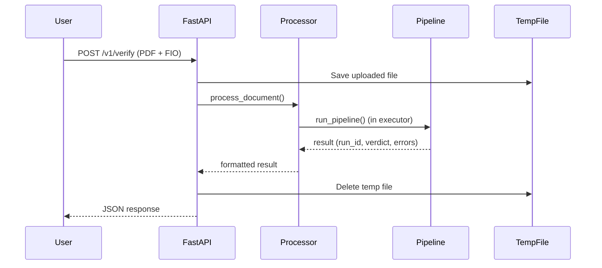

# 🎓 Complete Guide to Your FastAPI Service

> **Purpose**: This guide explains everything in your `fastapi-service` folder from absolute basics to advanced concepts. Perfect for someone with zero knowledge of APIs and web services.

---

## 📚 Table of Contents

1. [What is an API?](#1-what-is-an-api)
2. [Understanding REST APIs](#2-understanding-rest-apis)
3. [What is FastAPI?](#3-what-is-fastapi)
4. [Sync vs Async Programming](#4-sync-vs-async-programming)
5. [Your Project Structure](#5-your-project-structure)
6. [Core Concepts Explained](#6-core-concepts-explained)
7. [File-by-File Walkthrough](#7-file-by-file-walkthrough)
8. [How Everything Works Together](#8-how-everything-works-together)
9. [Deployment & Production](#9-deployment--production)

---

## 1. What is an API?

### 🔰 Basic Concept

**API** = **Application Programming Interface**

Think of an API like a **waiter in a restaurant**:
- **You** (the customer) = Your application/user
- **The kitchen** = Your backend code (the actual processing)
- **The waiter** = The API (carries your order to the kitchen and brings food back)

### Real Example from Your Code

When someone wants to verify a document:
1. They send a file to your API: `POST /v1/verify`
2. Your API receives it, processes it
3. Your API sends back a response: "✅ Valid" or "❌ Invalid"

```
User's Computer  ────[Upload PDF]────>  Your API  ────>  Processing Pipeline
                 <────[Response]─────
```

---

## 2. Understanding REST APIs

### 🔰 What is REST?

**REST** = **Representational State Transfer**

It's a **style/set of rules** for building APIs. Think of it as a "language" that computers use to talk over the internet.

### Key REST Concepts

#### HTTP Methods (Verbs)
- **GET**: Read/retrieve data (like viewing a webpage)
- **POST**: Create/send new data (like submitting a form)
- **PUT**: Update existing data
- **DELETE**: Remove data

#### Your API Uses POST
```python
@app.post("/v1/verify", response_model=VerifyResponse)
async def verify_document(...)
```

Why POST? Because you're **sending** a document for processing.

#### Status Codes
- **200**: Success! ✅
- **404**: Not found (wrong URL)
- **500**: Server error (something broke)

---

## 3. What is FastAPI?

### 🔰 The Framework

**FastAPI** is a Python library that makes it **super easy** to build APIs.

### Why FastAPI?

| Feature | Explanation |
|---------|-------------|
| **Fast** | Very high performance (as fast as Node.js or Go) |
| **Easy** | Simple Python decorators to create APIs |
| **Auto Docs** | Automatically creates documentation at `/docs` |
| **Type Safety** | Uses Python type hints for validation |
| **Async Support** | Can handle many requests at once |

### Basic Example

```python
from fastapi import FastAPI

app = FastAPI()

@app.get("/hello")
def say_hello():
    return {"message": "Hello World!"}
```

That's it! You just created an API endpoint!

---

## 4. Sync vs Async Programming

### 🔰 The Restaurant Analogy

#### Synchronous (Sync) - One Waiter
```
Order 1 ──> Waiter waits at kitchen ──> Serve ──> Take Order 2
           (doing nothing meanwhile)
```
- Waiter takes one order
- Waits at kitchen doing nothing
- Only then takes next order
- **Slow** when serving many customers

#### Asynchronous (Async) - Smart Waiter
```
Order 1 ──> Waiter gives to kitchen ──> Takes Order 2 ──> Takes Order 3
           (kitchen cooks meanwhile)   (kitchen cooks)
```
- Waiter takes order 1, gives to kitchen
- While kitchen cooks, takes orders 2, 3, 4...
- Serves whoever's ready first
- **Fast** when serving many customers

### In Your Code

```python
# Async function - can handle multiple requests
async def verify_document(file: UploadFile, fio: str):
    content = await file.read()  # "await" = "wait for this, but do other things meanwhile"
    result = await processor.process_document(...)
```

The `async` and `await` keywords let your API handle many document uploads **at the same time** instead of one-by-one.

---

## 5. Your Project Structure

```
fastapi-service/
├── main.py                 # 🚪 Entry point - Where your API starts
├── requirements.txt        # 📦 List of libraries needed
├── deploy.sh              # 🚀 Deployment script
├── Dockerfile             # 🐳 Docker container config
│
├── api/
│   └── schemas.py         # 📋 Data structure definitions
│
├── services/
│   └── processor.py       # ⚙️ Business logic wrapper
│
├── pipeline/              # 🔧 Your actual OCR/verification code
│   ├── orchestrator.py
│   ├── clients/
│   ├── processors/
│   └── ...
│
└── system/
    └── rb-ocr-fastapi.service  # 🖥️ Linux service config
```

---

## 6. Core Concepts Explained

### 🔰 Pydantic & Schemas

**Pydantic** = Data validation library

Think of it as a **blueprint** for your data:

```python
class VerifyResponse(BaseModel):
    run_id: str                    # Must be text
    verdict: bool                  # Must be True/False
    errors: List[ErrorDetail]      # Must be a list
    processing_time_seconds: float # Must be a number
```

**Why?**
- Ensures data is correct format
- Auto-generates documentation
- Catches errors early

### 🔰 Base Models

A **BaseModel** is like a template. All your data classes inherit from it:

```python
from pydantic import BaseModel

class ErrorDetail(BaseModel):  # Inherits validation powers
    code: str
    message: str | None
```

### 🔰 Decorators

A **decorator** is a function that modifies another function. In Python, they use `@`:

```python
@app.post("/v1/verify")  # This is a decorator
async def verify_document(...):
    ...
```

Here, `@app.post()` tells FastAPI:
- "When someone POSTs to `/v1/verify`..."
- "...run this function!"

### 🔰 Logging

**Logging** = Keeping a record of what happens

Instead of `print()`, use `logger.info()`:

```python
import logging

logger = logging.getLogger(__name__)

logger.info("Processing started")   # Info message
logger.error("Something broke!")    # Error message
```

**Why?**
- `print()` statements disappear
- Logs can be saved to files
- Different severity levels (info, warning, error)
- Timestamps automatically added

### 🔰 Asyncio

**asyncio** = Python's async library

```python
import asyncio

loop = asyncio.get_event_loop()
result = await loop.run_in_executor(None, some_sync_function)
```

This runs a **synchronous** function in an **async** way (useful when you have old code that doesn't support async).

### 🔰 Tempfile

**tempfile** = Creates temporary files

```python
import tempfile

with tempfile.NamedTemporaryFile(delete=False) as tmp:
    tmp.write(content)
    tmp_path = tmp.name  # "/tmp/random_abc123"
```

**Why?**
- Uploaded files need to be saved somewhere temporarily
- Auto-generates unique filenames
- Can auto-delete when done

### 🔰 Field (from Pydantic)

`Field` adds metadata to your model fields:

```python
from pydantic import Field

class VerifyResponse(BaseModel):
    run_id: str = Field(..., description="Unique run identifier")
                       # ^^^  ^^^^^^^^^^^  ^^^^^^^^^^^^^^^^^^^^^
                       # Required  Shows in API docs
```

---

## 7. File-by-File Walkthrough

### 📄 [main.py](file:///Users/aktilekishanov/Documents/career/forte/ds/rb_ocr/2025-11-14-apps-from-server-RBOCR/apps/fastapi-service/main.py)

**Purpose**: The entry point of your API

#### Line-by-Line Breakdown

```python
# Lines 1-8: Import libraries
from fastapi import FastAPI, File, UploadFile, Form, HTTPException
from api.schemas import VerifyResponse
from services.processor import DocumentProcessor
import tempfile, logging, time, os

# Lines 11-15: Setup logging
logging.basicConfig(
    level=logging.INFO,  # Show INFO and above (INFO, WARNING, ERROR)
    format='%(asctime)s - %(name)s - %(levelname)s - %(message)s'
)
logger = logging.getLogger(__name__)

# Lines 18-24: Create FastAPI app
app = FastAPI(
    title="RB-OCR Document Verification API",
    version="1.0.0",
    description="Validates loan deferment documents",
    docs_url="/docs",    # Auto-generated documentation page
    redoc_url="/redoc",  # Alternative documentation page
)

# Line 27: Create processor instance
processor = DocumentProcessor(runs_root="./runs")

# Lines 30-34: Define API endpoint
@app.post("/v1/verify", response_model=VerifyResponse)
#     ^^^^ HTTP Method    ^^^^^^^^^^^^ URL path
async def verify_document(
    file: UploadFile = File(..., description="PDF or image file"),
    #                  ^^^^ This is a file upload
    fio: str = Form(..., description="Applicant's full name (FIO)"),
    #          ^^^^  This comes from a form field
):
```

#### What Happens in `verify_document` Function?

```python
# Step 1: Record start time
start_time = time.time()

# Step 2: Save uploaded file temporarily
with tempfile.NamedTemporaryFile(delete=False, suffix=f"_{file.filename}") as tmp:
    content = await file.read()  # Read uploaded file
    tmp.write(content)           # Write to temp file
    tmp_path = tmp.name          # Get temp file path

# Step 3: Process the document
try:
    result = await processor.process_document(
        file_path=tmp_path,
        original_filename=file.filename,
        fio=fio,
    )
    
    # Step 4: Calculate processing time
    processing_time = time.time() - start_time
    
    # Step 5: Create response
    response = VerifyResponse(
        run_id=result["run_id"],
        verdict=result["verdict"],
        errors=result["errors"],
        processing_time_seconds=round(processing_time, 2),
    )
    
    return response

# Step 6: Handle errors
except Exception as e:
    raise HTTPException(status_code=500, detail=str(e))

# Step 7: Cleanup (always runs)
finally:
    os.unlink(tmp_path)  # Delete temp file
```

#### Other Endpoints

```python
@app.get("/health")
async def health_check():
    # Used by monitoring systems to check if API is running
    return {"status": "healthy"}

@app.get("/")
async def root():
    # Shows basic info when you visit the homepage
    return {"service": "RB-OCR...", "docs": "/docs"}
```

---

### 📄 [api/schemas.py](file:///Users/aktilekishanov/Documents/career/forte/ds/rb_ocr/2025-11-14-apps-from-server-RBOCR/apps/fastapi-service/api/schemas.py)

**Purpose**: Define the structure of your API data

```python
from pydantic import BaseModel, Field
from typing import List

class ErrorDetail(BaseModel):
    """Single error in validation"""
    code: str = Field(..., description="Error code (e.g., FIO_MISMATCH)")
    message: str | None = Field(None, description="Human-readable message")
    #            ^^^^^^  "str | None" means "text or empty"

class VerifyResponse(BaseModel):
    """What the API returns"""
    run_id: str  
    verdict: bool  
    errors: List[ErrorDetail]  # List of ErrorDetail objects
    processing_time_seconds: float
    
    class Config:
        json_schema_extra = {
            "example": {...}  # Shows example in API docs
        }
```

**Example Response**:
```json
{
  "run_id": "20251126_140523_abc12",
  "verdict": true,
  "errors": [],
  "processing_time_seconds": 12.4
}
```

---

### 📄 [services/processor.py](file:///Users/aktilekishanov/Documents/career/forte/ds/rb_ocr/2025-11-14-apps-from-server-RBOCR/apps/fastapi-service/services/processor.py)

**Purpose**: Wrapper around your pipeline (adapts sync code to async API)

```python
class DocumentProcessor:
    def __init__(self, runs_root: str = "./runs"):
        self.runs_root = Path(runs_root)
        self.runs_root.mkdir(parents=True, exist_ok=True)
        # Creates ./runs folder if doesn't exist
    
    async def process_document(self, file_path, original_filename, fio):
        # Problem: run_pipeline() is SYNC but our API is ASYNC
        # Solution: Run it in an "executor" (separate thread)
        
        loop = asyncio.get_event_loop()
        result = await loop.run_in_executor(
            None,  # Use default executor
            lambda: run_pipeline(  # Run this sync function
                fio=fio,
                source_file_path=file_path,
                original_filename=original_filename,
                content_type=None,
                runs_root=self.runs_root,
            )
        )
        
        return {
            "run_id": result.get("run_id"),
            "verdict": result.get("verdict", False),
            "errors": result.get("errors", []),
        }
```

---

### 📄 [requirements.txt](file:///Users/aktilekishanov/Documents/career/forte/ds/rb_ocr/2025-11-14-apps-from-server-RBOCR/apps/fastapi-service/requirements.txt)

**Purpose**: Lists all Python libraries needed

```txt
# FastAPI and server
fastapi==0.104.1          # The API framework
uvicorn[standard]==0.24.0 # ASGI server (runs your app)
gunicorn==21.2.0          # Production server manager
python-multipart==0.0.6   # Handles file uploads
pydantic==2.5.0           # Data validation

# Pipeline dependencies
httpx==0.25.1             # HTTP client (like requests but async)
rapidfuzz==3.5.2          # Fuzzy string matching
pypdf==3.17.1             # PDF processing
pillow==10.1.0            # Image processing
```

**Install with**: `pip install -r requirements.txt`

---

### 📄 [deploy.sh](file:///Users/aktilekishanov/Documents/career/forte/ds/rb_ocr/2025-11-14-apps-from-server-RBOCR/apps/fastapi-service/deploy.sh)

**Purpose**: Automated deployment script for Linux server

```bash
#!/bin/bash
set -e  # Exit if any command fails

# Step 1: Activate virtual environment
source .venv/bin/activate

# Step 2: Verify dependencies are installed correctly
pip check

# Step 3: Test that imports work
python3 -c "from pipeline.orchestrator import run_pipeline; ..."

# Step 4: Create log directory
sudo mkdir -p /var/log/rb-ocr-api
sudo chown rb_admin2:rb_admin2 /var/log/rb-ocr-api

# Step 5: Install systemd service
sudo cp system/rb-ocr-fastapi.service /etc/systemd/system/
sudo systemctl daemon-reload       # Reload service configs
sudo systemctl enable rb-ocr-fastapi  # Start on boot
sudo systemctl restart rb-ocr-fastapi # Restart service

# Step 6: Check if it's running
sudo systemctl status rb-ocr-fastapi --no-pager

echo "✅ Deployment complete!"
```

---

### 📄 [Dockerfile](file:///Users/aktilekishanov/Documents/career/forte/ds/rb_ocr/2025-11-14-apps-from-server-RBOCR/apps/fastapi-service/Dockerfile)

**Purpose**: Recipe to build a Docker container

**Docker** = A way to package your app with all dependencies into a "container" that runs anywhere

```dockerfile
FROM python:3.11-slim
# Start with Python 3.11 base image

WORKDIR /app
# All commands run in /app folder

# Install system dependencies (Tesseract OCR, etc.)
RUN apt-get update && apt-get install -y \
    tesseract-ocr \
    libgl1-mesa-glx \
    libglib2.0-0 \
    && rm -rf /var/lib/apt/lists/*

# Install Python packages
COPY requirements.txt .
RUN pip install --no-cache-dir -r requirements.txt

# Copy your code
COPY . .

# Create runs directory
RUN mkdir -p /app/runs && chmod 777 /app/runs

EXPOSE 8000
# Container listens on port 8000

# Run with Gunicorn
CMD ["gunicorn", "main:app", \
     "--workers", "4", \
     "--worker-class", "uvicorn.workers.UvicornWorker", \
     "--bind", "0.0.0.0:8000"]
```

**Build**: `docker build -t rb-ocr-api .`  
**Run**: `docker run -p 8000:8000 rb-ocr-api`

---

### 📄 [system/rb-ocr-fastapi.service](file:///Users/aktilekishanov/Documents/career/forte/ds/rb_ocr/2025-11-14-apps-from-server-RBOCR/apps/fastapi-service/system/rb-ocr-fastapi.service)

**Purpose**: Linux systemd service definition (runs your API as a system service)

**systemd** = Linux's system manager (starts services, restarts if they crash, etc.)

```ini
[Unit]
Description=RB-OCR FastAPI Service
After=network.target  # Start after network is ready

[Service]
Type=simple
User=rb_admin2  # Run as this user
WorkingDirectory=/home/rb_admin2/apps/fastapi-service

# Set PATH to use your virtual environment
Environment="PATH=/home/rb_admin2/apps/fastapi-service/.venv/bin"

# Command to run
ExecStart=/home/rb_admin2/apps/fastapi-service/.venv/bin/gunicorn main:app \
    --workers 4 \
    --worker-class uvicorn.workers.UvicornWorker \
    --bind 0.0.0.0:8001 \
    --timeout 60 \
    --access-logfile /var/log/rb-ocr-api/access.log \
    --error-logfile /var/log/rb-ocr-api/error.log

Restart=always      # Auto-restart if crashes
RestartSec=10       # Wait 10 seconds before restarting

[Install]
WantedBy=multi-user.target  # Start on system boot
```

---

## 8. How Everything Works Together

### 🔄 Complete Request Flow



### Step-by-Step Example

**1. User uploads document**
```bash
curl -X POST http://localhost:8001/v1/verify \
  -F "file=@document.pdf" \
  -F "fio=Иванов Иван Иванович"
```

**2. FastAPI receives request**
```python
@app.post("/v1/verify")
async def verify_document(file: UploadFile, fio: str):
    # FastAPI automatically parses the file and fio from the request
```

**3. Save to temp file**
```python
with tempfile.NamedTemporaryFile() as tmp:
    content = await file.read()
    tmp.write(content)
    # File saved to /tmp/tmpXYZ123_document.pdf
```

**4. Process document**
```python
result = await processor.process_document(
    file_path="/tmp/tmpXYZ123_document.pdf",
    fio="Иванов Иван Иванович"
)
# Calls your pipeline code
```

**5. Return response**
```json
{
  "run_id": "20251127_103000_xyz",
  "verdict": true,
  "errors": [],
  "processing_time_seconds": 15.3
}
```

**6. Cleanup**
```python
os.unlink(tmp_path)  # Delete temp file
```

---

## 9. Deployment & Production

### 🔰 Uvicorn vs Gunicorn

| Tool | Purpose | When to Use |
|------|---------|-------------|
| **Uvicorn** | ASGI server | Development, single worker |
| **Gunicorn** | Process manager | Production, multiple workers |

#### Uvicorn (Development)
```bash
uvicorn main:app --reload
```
- **One worker** (one process)
- Auto-reloads on code changes
- Good for development

#### Gunicorn + Uvicorn (Production)
```bash
gunicorn main:app \
  --workers 4 \
  --worker-class uvicorn.workers.UvicornWorker
```
- **Multiple workers** (4 processes)
- If one crashes, others keep running
- Handles more traffic
- Production-ready

### 🔰 Workers Explained

**Worker** = A separate process handling requests

```
Incoming Requests ──┬──> Worker 1 (processing request A)
                    ├──> Worker 2 (processing request B)
                    ├──> Worker 3 (processing request C)
                    └──> Worker 4 (idle, waiting)
```

**Why multiple workers?**
- Python's GIL (Global Interpreter Lock) limits one process to one CPU core
- 4 workers = can use 4 CPU cores
- Better performance under high load

### 🔰 Master Process

**Gunicorn Master** = Parent process that manages workers

```
Master Process
├── Worker 1
├── Worker 2
├── Worker 3
└── Worker 4
```

- Master spawns workers
- If a worker crashes, master restarts it
- Master handles shutdown gracefully

### 🔰 HTTPX

**httpx** = Modern HTTP client library

```python
import httpx

# Synchronous
response = httpx.get("https://api.example.com")

# Asynchronous (async/await)
async with httpx.AsyncClient() as client:
    response = await client.get("https://api.example.com")
```

Think of it as `requests` library but with async support.

### 🔰 python-multipart

**python-multipart** = Handles file uploads in FastAPI

```python
@app.post("/upload")
async def upload(file: UploadFile = File(...)):
    # python-multipart parses the uploaded file behind the scenes
    content = await file.read()
```

Without it, FastAPI can't handle `multipart/form-data` (file uploads).

---

## 📖 Quick Reference Glossary

| Term | Simple Explanation |
|------|-------------------|
| **API** | Interface for programs to talk to each other |
| **REST API** | API that follows specific rules (using HTTP methods) |
| **FastAPI** | Python framework for building APIs quickly |
| **Async/Await** | Handle multiple tasks at once without blocking |
| **Pydantic** | Library for data validation using Python types |
| **BaseModel** | Template class from Pydantic for your data structures |
| **Schema** | Blueprint defining what your data looks like |
| **Decorator** | `@syntax` that modifies functions (like `@app.post()`) |
| **Uvicorn** | Server that runs async Python apps (ASGI) |
| **Gunicorn** | Manager that runs multiple worker processes |
| **Worker** | Separate process handling requests |
| **tempfile** | Creates temporary files that auto-delete |
| **logging** | Better than `print()`, saves logs with timestamps |
| **asyncio** | Python's async programming library |
| **httpx** | HTTP client with async support |
| **systemd** | Linux service manager |
| **Docker** | Package apps in containers with all dependencies |

---

## 🎯 Learning Path Recommendations

### If you want to learn more:

1. **FastAPI Basics** → [Official Tutorial](https://fastapi.tiangolo.com/tutorial/)
2. **Async Python** → [Real Python Guide](https://realpython.com/async-io-python/)
3. **Pydantic** → [Official Docs](https://docs.pydantic.dev/)
4. **REST APIs** → Search "REST API explained for beginners"
5. **Docker** → [Docker Getting Started](https://docs.docker.com/get-started/)

### Practice Exercises

1. Add a new endpoint to check API version
2. Add logging to track how many requests you've processed
3. Create a new schema for a different type of response
4. Modify the health check to return more information

---

## ❓ Common Questions

**Q: Why use async if my pipeline is synchronous?**  
A: Async helps FastAPI handle multiple uploads simultaneously. While one document is processing, another can start uploading.

**Q: What's the difference between Uvicorn and Gunicorn?**  
A: Uvicorn is a worker (does the work), Gunicorn is a manager (manages workers).

**Q: Why do we need schemas?**  
A: They validate data, prevent errors, and auto-generate documentation.

**Q: Can I run this without Docker?**  
A: Yes! Just use `uvicorn main:app` or the systemd service.

**Q: What happens if a worker crashes?**  
A: Gunicorn automatically restarts it.

---

🎉 **Congratulations!** You now understand your FastAPI service from top to bottom!
