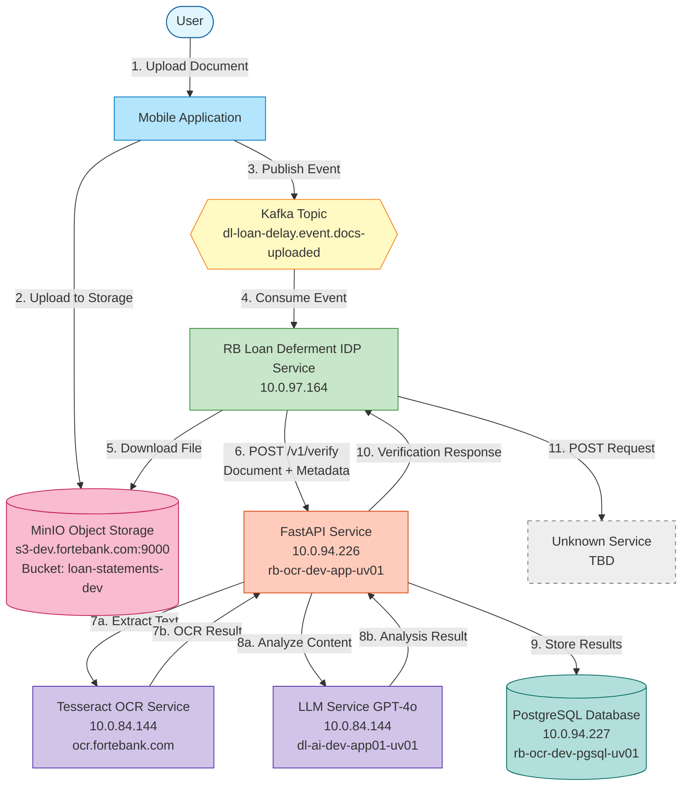
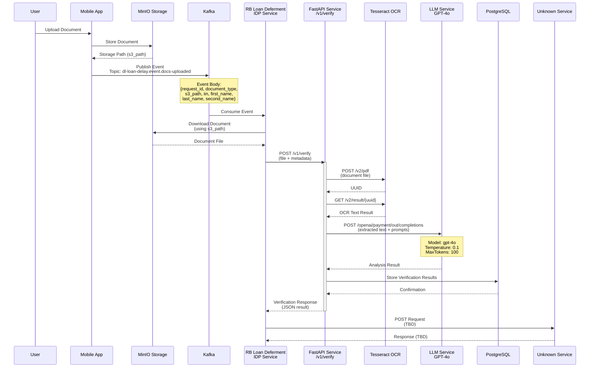
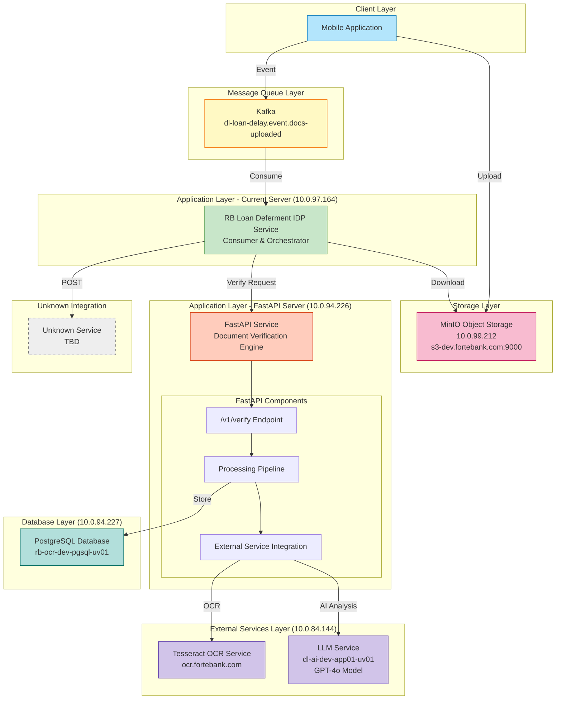
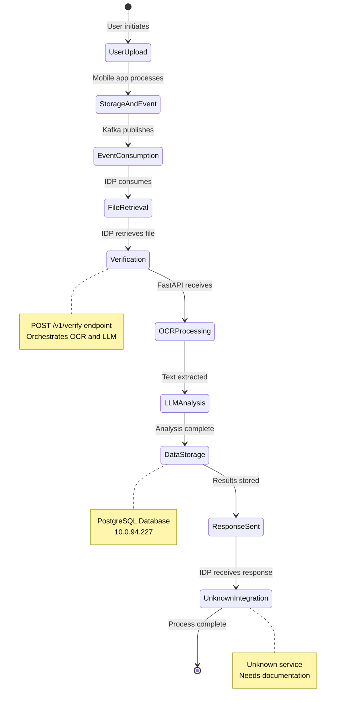

# RB OCR System Architecture

> **Document Purpose**: This document provides comprehensive visual representations of the RB OCR system architecture, including data flow, component interactions, and infrastructure layout.

---

## Table of Contents
1. [High-Level Data Flow](#1-high-level-data-flow)
2. [Sequence Diagram](#2-sequence-diagram)
3. [Component Architecture](#3-component-architecture)
4. [Infrastructure Layout](#4-infrastructure-layout)
5. [Integration Details](#5-integration-details)

---

## 1. High-Level Data Flow

This diagram illustrates the complete journey of a document through the system, from user upload to final processing.



---

## 2. Sequence Diagram

This diagram shows the detailed interaction timeline between all system components.



---

## 3. Component Architecture

This diagram illustrates the system's component organization and dependencies.



---

## 4. Infrastructure Layout

This diagram shows the physical/network infrastructure distribution.

```mermaid
graph TB
    subgraph Internet["Internet / Mobile Network"]
        Mobile[Mobile Application]
    end
    
    subgraph DevInfra["Development Infrastructure - ForteBank Network"]
        
        subgraph MinIOServer["MinIO Server<br/>10.0.99.212<br/>s3-dev.fortebank.com"]
            MinIOService[MinIO Service<br/>Port: 9000<br/>Bucket: loan-statements-dev]
            MinIOCreds["Credentials:<br/>Access: fyz13d2czRW7l4sBW8gD<br/>Secret: 1ix...1A<br/>API: s3v4"]
        end
        
        subgraph CurrentServer["Current Server<br/>10.0.97.164<br/>cfo-prod-llm-uv01"]
            IDPService[IDP Service]
            Nginx1[Nginx<br/>Port 8004: main<br/>Port 8006: main-dev]
            Docker1[Docker 28.5.1<br/>Docker Compose v2.40.2]
        end
        
        subgraph FastAPIServer["FastAPI Server<br/>10.0.94.226<br/>rb-ocr-dev-app-uv01"]
            FastAPIApp[FastAPI Application<br/>Document Verification]
            FastAPIDep[Dependencies:<br/>Tesseract Client<br/>LLM Client<br/>PostgreSQL Client]
        end
        
        subgraph DBServer["Database Server<br/>10.0.94.227<br/>rb-ocr-dev-pgsql-uv01"]
            PostgreSQL[(PostgreSQL<br/>Database)]
            DBCreds["Account: TBA<br/>Password: TBA"]
        end
        
        subgraph ExternalServer["External Services Server<br/>10.0.84.144"]
            TesseractAPI[Tesseract OCR<br/>ocr.fortebank.com<br/>Endpoints:<br/>POST /v2/pdf<br/>GET /v2/result/{uuid}]
            LLMAPI[LLM Service<br/>dl-ai-dev-app01-uv01<br/>Endpoint:<br/>POST /openai/payment/out/completions]
        end
        
        KafkaCluster{{Kafka Cluster<br/>Topic: dl-loan-delay.event.docs-uploaded}}
    end
    
    Mobile -->|HTTPS| MinIOService
    Mobile -->|Event| KafkaCluster
    KafkaCluster -->|Subscribe| IDPService
    IDPService -->|S3 API| MinIOService
    IDPService -->|HTTP POST| FastAPIApp
    FastAPIApp -->|HTTPS| TesseractAPI
    FastAPIApp -->|HTTPS| LLMAPI
    FastAPIApp -->|SQL| PostgreSQL
    
    style Mobile fill:#b3e5fc,stroke:#0277bd
    style MinIOServer fill:#f8bbd0,stroke:#c2185b
    style CurrentServer fill:#c8e6c9,stroke:#388e3c
    style FastAPIServer fill:#ffccbc,stroke:#d84315
    style DBServer fill:#b2dfdb,stroke:#00695c
    style ExternalServer fill:#d1c4e9,stroke:#512da8
    style KafkaCluster fill:#fff9c4,stroke:#f57f17
```

---

## 5. Integration Details

### 5.1 Kafka Event Schema

**Topic**: `dl-loan-delay.event.docs-uploaded`

**Event Body**:
```json
{
    "request_id": 123123,
    "document_type": 4,
    "s3_path": "some_s3_address",
    "iin": 960125000000,
    "first_name": "Иван",
    "last_name": "Иванов",
    "second_name": "Иванович"
}
```

### 5.2 MinIO Configuration (DEV)

| Property | Value |
|----------|-------|
| **IP** | 10.0.99.212 |
| **Domain** | s3-dev.fortebank.com:9000 |
| **Bucket** | loan-statements-dev |
| **Access Key** | fyz13d2czRW7l4sBW8gD |
| **Secret Key** | 1ixYVVoZKSnG0rwfTy0vnqQplupXOOn8DF9gS1A |
| **API Version** | s3v4 |
| **Path Style** | auto |

### 5.3 FastAPI Endpoint

**Endpoint**: `POST /v1/verify`

**Purpose**: Receives document verification requests from the IDP service, processes documents through OCR and LLM pipelines, stores results in PostgreSQL, and returns verification response.

### 5.4 Tesseract OCR Integration

**Base URL**: `https://ocr.fortebank.com`

**Endpoints**:
1. `POST /v2/pdf` - Submit document for OCR processing
   - Form-data: `file` (document file)
   - Returns: UUID for result retrieval
   
2. `GET /v2/result/{uuid}` - Retrieve OCR results
   - Returns: Extracted text from document

### 5.5 LLM Service Integration

**Base URL**: `https://dl-ai-dev-app01-uv01.fortebank.com`

**Endpoint**: `POST /openai/payment/out/completions`

**Request Body**:
```json
{
    "Model": "gpt-4o",
    "Content": "extracted text + prompts",
    "Temperature": 0.1,
    "MaxTokens": 100
}
```

**Response Structure**:
```json
{
    "choices": [{
        "message": {
            "content": "analysis result",
            "role": "assistant"
        },
        "finish_reason": "stop"
    }],
    "model": "gpt-4o-2024-08-06",
    "usage": {
        "total_tokens": 30,
        "prompt_tokens": 13,
        "completion_tokens": 17
    }
}
```

### 5.6 Server Infrastructure

| Server Type | IP | Domain | Details |
|-------------|----|----|---------|
| **Current Server** | 10.0.97.164 | cfo-prod-llm-uv01.fortebank.com | Nginx (8004, 8006)<br/>Docker 28.5.1 |
| **FastAPI Server** | 10.0.94.226 | rb-ocr-dev-app-uv01.fortebank.com | Account: rb_admin<br/>Password: Ret_ban_ocr1 |
| **Database Server** | 10.0.94.227 | rb-ocr-dev-pgsql-uv01.fortebank.com | PostgreSQL<br/>Account: TBA |
| **External Services** | 10.0.84.144 | ocr.fortebank.com<br/>dl-ai-dev-app01-uv01 | Tesseract OCR<br/>LLM Service |
| **MinIO Storage** | 10.0.99.212 | s3-dev.fortebank.com:9000 | Object Storage |

### 5.7 Unknown Integration Point

> [!WARNING]
> **Unknown Service Integration**
> 
> The IDP service sends a POST request to an unknown service after receiving the verification response from FastAPI. This integration point needs to be documented.
> 
> **Action Required**: Identify the target service and document:
> - Service purpose and endpoint
> - Request/response schema
> - Error handling requirements

---

## Processing Flow Summary



---

## Document Metadata

- **Created**: 2025-12-02
- **Source**: [integration-details.md](file:///Users/aktilekishanov/Documents/career/forte/ds/rb_ocr/2025-11-14-apps-from-server-RBOCR/apps/.etc/.info-project-management/integration-details.md)
- **Related**: [servers.md](file:///Users/aktilekishanov/Documents/career/forte/ds/rb_ocr/2025-11-14-apps-from-server-RBOCR/apps/.etc/.info-project-management/servers.md)
- **Status**: Active Development
